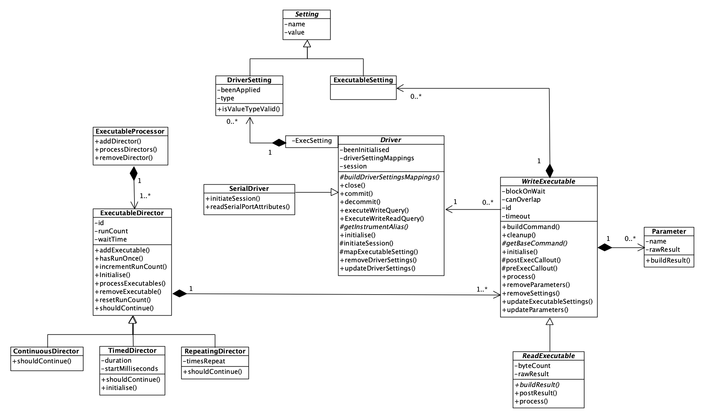
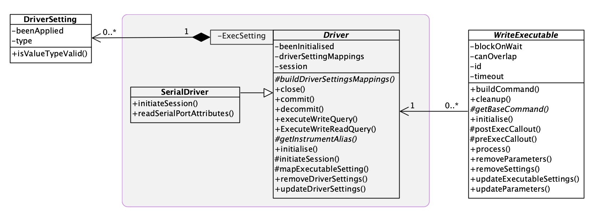

# Hardware Abstraction Framework
This framework provides a means of driving test instruments through the use of abstract commands (non-instrument specific) in an automated way.

Currently, the framework is very SCPI focussed but can be extended to support other test syntaxes. In the current version (1.n.n) available commands are extremely limited but the fundamental framework is in place.

## Dependencies
Depending on how you wish to deploy, there are no dependencies for the framework.  If you want to use the framework's Unit Tests then you must download and deploy the `Unit Testing Framework` as well.

## Installation
Download directory `Hardware Abstraction Framework` to wherever you want it and you are good to go.  

If you wish to use the Unit Tests in this framework, download the `Unit Testing Framework` (UTF) into the same root directory and it should be picked up as a link.  If not, or you deploy the UTF to a different directory, you will need to re-import it.

## Overview
The basic approach to instrument testing is to send one or more commands to one or more instruments and process the results.  Some tests will be simple, one-off commands; others will be more complex involving multiple commands, over multiple instruments, over an extended period of time.

The framework attempts to meet these needs and has some basic concepts which a user should be aware of:
* **Commands:** a command is an instruction sent to an instrument that it can understand, run and, if necessary, provide a result.  The framework seperates out *instrument specific* commands from *instrument independent* commands which means that you can build tests up without a specific understanding of instrument-specific syntax, e.g. you could use a command such as `identity` rather than `*IDN?`.  The framework calls these `Executables` and there are two types: a `Write Executable` - sends a command only - and `Read Executable` - sends a command then reads a result.
* **Instrument:** a representation of an acutal test device to be used.  This can be anything that can be driven by LabVIEW NXG and the framework doesn't require instrument-specific drivers.  Instruments are abstracted so that you can use them 'generically' leaving the framework to do any necessary translation into 'specifics'.  Obviously, to use your own instruments you will need to provide some of this translation but the benefit will be that your overarching tests can be generic and reusable across different instruments, e.g. substitution of one manufacturer's DMM with another manufacturer's DMM without change to the test.  The framework calls these instrument abstractions `Drivers`.  Drivers provide the interface between the framework and an instrument.
* **Processors:** these actually run the Executables against a Driver in a controlled manner.  They control the overall execution flow utilising events and messages to interact with the test application itself.  Complex processing can be controlled by using specific types of processors: single-shot, repeating, continuous, timed and so on.  The framework calls these `Executable Processor` and `Executable Director`.

The basic approach to running a test is to follow these steps:
1. Instantiate an `Executable` that represents the command you wish to use.
2. Associate a `Driver` to that Executable which will represent the instrument to send the Executable (command) to.
3. Repeat this for each command you want to run in your test.
4. Associate these Executables to one or more `Executable Directors`, selected on the basis of how you wish the commands to run.  For example, you may select an `Executable Director` to run once a `Reset` Executable and a `Repeating Director` to run a `Measure` Executable 10 times.
5. Associate these Executable Directors to an `Executable Processor` and run the test.  The Processor will process each Executable Director until they have finished; results are sent back to the testing application as notifications and the Processor will listen for events such as `Pause`, `Resume`, `Stop` and modify the processing accordingly.
6. Your test app can listen out for a `Done` event to know when processing has finished; it can also look for `result` messages or `result notifier` notifications to handle and display those.  How complex you make these is up to you but check out the examples for ideas.

Many Executables in the framework can be used as-is in test applications but there may be Executables that are missing for your purpose.  You can create your own by following the pattern established for the existing ones.

Similarly, the Executable Directors are likely to be sufficient for most test applications but again, you can create your own by following the pattern established for the existing ones.

Unless you use the same instruments that are wrapped by Drivers in the framework, it is most likely that you will have to create your own for your instruments.  Again you can follow the pattern established for the existing ones; you may want to consider uploading these to the repository for inclusion in a future release.

The rest of this document describes the framework in more detail and how you can use it.
### Interacting with the Framework
Your test application will interact with the framework through other means than just asking it to process Executables.  The Framework is set up to respond to `Events` your test application can raise:
* **Pause:** Processing will be paused at the end of the current processing of Executable Director(s) - remember these could be long-running.  It does need to finish any currently running processing so as to ensure instruments are not left in an unknown state.  The Pause will timeout after 60-seconds and all processing will finish with an error being returned indicating the timeout occurred.
* **Resume:** Processing will be resumed if paused.
* **Stop:** Processing will stop immediately after the current processing of Executable Director(s) - again, so that instruments are not left in an unknown state.

***
There is no concept of *Abort Immediately* - the framework will always attempt to properly close an instrument down so that it is not left in an unknown state.
***

The Framework will interact with your test application through `Events` as well:
* **Done:** Raised by the Framework when all processing has completed. You could, perhaps, on hearing this event, unblock the UI, display any messages, quit the test app, write results to a database and so on.

It also interacts with your test application via messages on a Notification Queue or via a notifier:
* **Result:** When a `Read Executable` runs and receives a result, it stores that and posts itself on to the Notification Queue as message data for the `Result` message.  Your test application should be waiting to receive these messages so you can do something with the result.  The Executable knows how to process a raw result (from the instrument) into something useable and of a specific data type; any results for parameters can also be processed into useable information.  Each Executable has a unique ID and you can tie a result on the Notification queue to a specific Executable instance so your test application knows how to handle the result.

* **Result Notifier:** Create a Notifier and pass it into the Framework.  Each result received will be posted through this notifier to the test app (as for Result, the data passed is the Executable itself which stores the result.)

Which to use?  The framework may block the Test App when it is called, until all processing is finished.  Whilst the results will be posted as messages on the Notification queue, your test app won't get a chance to process them until the Framework is `Done`.  This is fine for simple commands but no use for long-running commands.  In the latter case, you will want a parallel thread waiting on a Notifier to appear containing the result - these can be processed as they are generated by the Framework, irrespective of whether the rest of the Test App is blocking.  There are examples that show both approaches.

Events, Messages and Notification Queues are all established by the Framework and are available for your test application to use.  You must create your own Notifier to pass into the Framework if you take this approach for result processing.

Examine the example applications to see how to use Events and Notifications.  These example applications form a great template for building your own applications on.

## Framework Structure
The framework has been mostly written using LabVIEW NXG's object oriented features so the majority of interaction between your test application and the framework will involve the use of classes; extensions to the framework will likewise be done through extending existing classes and overriding methods.

As the source is provided, you are encouraged to use one of the examples and single-step through it observing how the framework is called and how interactions play back-and-forth.

In terms of processing, the framework follows a Queued Message Handler pattern which is standardised within LabVIEW NXG.  The examples, although simple in themselves, also use this approach to provide a basic pattern for you to follow in your own test applications.

***
**A note on LabVIEW NXG's approach to object oriented programming**

NI decided that a by-value approach to objects will be used, rather than by-reference.  The implications of this is that all data flows work on *copies* of data rather than references.  You need to bear this in mind as it is easy to get caught out.  In many cases, changing some object's data member will be on that copy and not an originating instance - the data will need writing back to that instance.  This can be confusing when changes don't work!  The framework takes care of it correctly in its own processing, but any you add, or code within your test application must be carefully written to avoid data loss or unexpected behaviour.

There is very little in the way of reflection available in the language so some actions are not as independent of implementation as they could be otherwise.
***
### Core Classes
Note: The diagrams below are intended to show main classes and methods and are not a complete picture of the framework.

The class diagram above shows the classes and relationships that form the core element of the framework.  I'll break it down into smaller sections.
#### Executable

An Executable represents a command that can be sent to an Driver for running on an instrument.  As the framework evolves over time, these will become much more than just commands for Drivers, and will represent other execution constructions such as optional pathways, or directives to help with processing.

There are two types of Executable:
* **WriteExecutable:** represents a command that can be sent to an instrument but which requires no response.
* **ReadExecutable:** represents a command that can be sent to an instrument and for which a response or result will be returned.  You will note it inherits some of its functionality from `WriteExecutable`: you don't need to run a Write Executable *and* a Read Executable as the latter incorporates the functionality for you.

An Executable is associated with a `Driver` whose responsibility it is to undertake any instrument specific translation of a command.  The framework will arrange for the Driver to run the command at the appropriate moment.

There are two ways a `Driver` can run an Executable:
* Immediately: as it says - the Driver sends the command straight to the instrument.
* When able: in this case, the Driver will wait for the instrument to finish processing any existing commands before sending this one.

An Executable controls this with its `canOverlap` property: if true, the Executable will be run immediately; if false, when able.

A `ReadExecutable` will hold a result returned from the instrument.  It does so in a raw form, `rawResult` - that is, it provides no interpretation of that result until asked to do so by the test application calling `buildResult`.  The test application will be notified of an available result via a `result` message raised on the `Notification` queue or a raised `Notifier`.  The result data is the same in both cases: the Executable itself is passed back to the test app and can be used to obtain the results as a raw value (String) or a typed value.

Some Executables can take parameters to send along with the base command.  These are represented by the `Parameter` class.  The framework will automatically add any requested parameters to the command before it is sent to the instrument: you just need to add the ones you want to the Executable when you create an instance of it.  A Parameter will hold a result, if available, and is capable of parsing that into a typed value for the test application.

`Executable Settings` are a way of provisioning configuration settings for Drivers, independently of how they may be applied to an instrument.  For example, you might use an Executable Setting called 'Settling Time'; on one DMM it might equate to 'Settle Time' whilst on another it might be 'Settling Duration'.  You won't care - the driver will map these to instrument specific configurations.

You'll see from the class diagram that Executable Settings provides no specific behaviour so is really just a placeholder.  There is more information in the [Settings](#settings) section below, but the functionality for settings hasn't needed any specific behaviour for Executables in the current version.

So what do you need to do to use the framework?  Basically, just use one of the existing Executables and add it to an Executable Director.  If none of the existing Executables are of any use, then create your own by following the pattern established by an existing one.

Here's an overview of two Executables:

You can see that all is needed is a concrete implementation of `getBaseCommand` (the command as it appears without any parameters or end of line characters) and, for Read Executables, a concrete implementation of `buildResult` which parses a raw result into a useable format for the test application.

#### Driver

`Driver` is responsible for interfacing with actual test instruments providing the necessary mappings between a generic test language and instrument-specific language.  By doing this, a user of the framework can standardise on names for things like commands, parameter names, setting names and so on and leave the Driver to translate on an instrument-by-instrument basis.

`SerialDriver` should be used for instruments that will use a Serial communication method, e.g. Arduino Uno.  This operates the same way as the standard Driver but expects a device to be available on a mapped `COM` port rather than on, say, a `USB` port.

It is envisaged that future versions of the framework will be able to load mappings between the generic and specific from an external source to allow tests to be more configurable.

A Driver will execute a query for an Executable when directed by the framework, obtaining a response as necessary.

`Driver Settings` are configurable items for an instrument and are mapped between a generic `Executable Setting` and the instrument setting.  More information is available in the [Settings](#settings) section.

So what do you need to do?  When you instantiate an Executable you need to give it a Driver to be used to process it.  It's likely you will need to create your own Driver instances but examples are available to draw from:

You can see here that all you need to provide is a concrete implementation for `buildDriverSettingsMappings` and `getInstrumentAlias` as the framework handles everything else.

The Arduino Uno Driver also provides an overridden `readSerialPortAttributes` because I want to communicate with it at 115200 baud, rather than the default 9600 baud, and I need the initialisation to wait 2000milliseconds after opening a port to ensure the Arduino will be available to process commands.

These concrete Drivers are available in namespace `Z_Implementation`.

#### Setting

`Setting` is meant to represent a specific configuration setting that can be sent to the instrument by the Driver - you can see it has a `name` and `value`.

There are two types of Setting:
* **DriverSetting:** This represents setting *as known to the instrument*.  The `type` is so that the framework can properly parse the value; `beenApplied` is set by the framework once the setting has been made so that it doesn't constantly send it on every command (see the section on process flow) - this could be reset so it is re-applied.  In fact, if you use a `Reset` Executable, it ensures that the settings will be re-applied.
* **ExecutableSetting:** This represents a generic, non-instrument specific setting, i.e. a setting you can refer to for all instruments.  The Driver maps this setting to a `DriverSetting` which then removes any concern of naming differences.  E.g. you could refer to a setting `Settle Time` and on one DMM it might actually be `Settling Time` and on another DMM it might be `Time to Settle`.

You add Executable Settings to the Executable as you instantiate it.  If you create a Driver, you must also create a set of mappings from `ExecutableSetting` to `DriverSetting`; if a setting is not used by a particular driver, use `Ignore` as the mapped name and that's what the framework will do.

***
**Note:** The framework is currently very SCPI focussed and settings aren't actually used yet.  As the framework evolves it is envisaged they will become more integrated and the feature finished.

Therefore, currently, you should not use Settings as they are not implemented.
***

#### Processing

Processing of `Executables` is performed through `Executable Director` instances and a `Executable Processor` instance.

* **Executable Director:** The Director controls the processing of one or more Executables. Each Executable is processed at least once and depending upon the choice of Executable Director, multiple times.

    * Executable Director: processes each Executable once only.
    * Repeating Director: processes each Executable `timesRepeat` times.
    * Continuous Director: processes each Executable continuously until ordered to stop.  Your test application can do this by raising a `stop` event.  You could abort the running VI but this may leave the instrument in an unknown state (recover with a `reset` Executable in the next test run.)
    * Timed Director: processes each Executable for a minimum period of time.

        An Executable Director can hold more than one Executable and each Executable is processed in turn in the order loaded.  A processing run for an Executable Director is 'every Executable', so `Stop` and `Pause` orders (via events) are acted on at the end of a run (actually, at the start of the next run if there is one.)  For the Timed Director, the duration is a minimum amount of time because a processing run will be completed once started; note also that a `Pause` order does not stop the clock and the duration paused counts towards the overall duration.

        `waitTime` is a duration in milliseconds between processing of each Executable.  So with a wait time of 10ms, and three Executables, processing will be Executable1-wait 10ms-Executable2-wait 10ms-Executable3.  For a Timed Director, this wait also counts towards the processing duration.

* **Executable Processor:** This is the framework's main control processor, responsible for processing all Executable Directors.  You only need one instance of this and processing starts by calling member `processDirectors()`.  The Executable Processor listens for `Stop`, `Pause`, and `Resume` events, acting accordingly on the Executable Directors.  Although not a member property, `processDirectors()` takes a `waitTime` as a parameter which acts the same way as `waitTime` on the Executable Director, except the wait is between Directors not Executables.

    You select the Executable Director(s) you want and add them to the Executable Processor.  Thus you can mix-and-match the testing you want.  For example, you could load a `Reset` Executable into a Executable Director, followed by a `Measure` Executable into a Continous Director.  This would then reset the instrument and continuously perform a measurement.

You should have no need to create an alternative Executable Processor but you may want a different Executable Director.  Create this as a subclass of ExecutableDirector and implement `shouldContinue()` (return true if processing of Executables should occur again) and if necessary `initialise()` if the Executable Director needs any setup (for example, the TimedDirector sets its `startMilliseconds` property in initialise so it can determine when the duration has elapsed.) 

Note that a `Pause` event will be acted upon but it will timeout after 60 seconds regardless of whether a `Resume` event is raised. This is to prevent Instruments just 'sitting there' and the pause event is not intended for long term interrupt of Executable Processing.

### Processing Loop

The flow diagram above shows the high-level processing when `processDirectors()` is called on `ExecutableProcessor`.  This is all under the control of the framework of course, you just need to instantiate the necessary Executable Directors and Exectubles.  Note that Executable Directors can finish independently of each other and are ignored in any subsequent run through.  For example, in the above image, if ExecDirector1 was a Timed Director of 1 minute; ExecDirector2 was a Continuous Director; and ExecDirector3 was a single-shot Director (ExecutableDirector instance) then:
* All will be processed in the first run through
* In the second run through, ExecDirector3 will return `false` for `shouldContinue()` so won't run anymore
* In the third and subsequent run throughs up until 1 elapsed minute, ExecDirector2 and ExecDirector3 will run;
* In runs after 1 minute only ExecDirector3 will run, and will continue to do so until told to stop. 

So what happens when an Executable is processed? 

*Write Executable*

* **Pre-Exec Callout:** run any Executable specific code before the Driver runs the command.
* **Update Settings:** add any new Executable Settings to the Driver, which will map them to Driver Settings
* **Initialise:** tell the Driver to create a session to the Instrument if one doesn't already exist
* **Commit:** send any unprocessed Driver Settings to the Instrument
* **Write Query:** send the command to the Instrument
* **Post Exec Callout:** run any Executable specific code after the driver runs the command.

The `Pre-Exec Callout` and `Post-Exec Callout` can be implemented in your own Driver if something must be done before/after the query is sent.  For example, in Post-Exec Callout the `Reset` Executable, tells the Driver to reset all its Driver Settings so they will be reapplied before the next Exectuable runs.

*Read Executable*

The lead-in is the same as a Write Executable but the additional steps are:
* **Exec Write Read Query:** sends the command to the Instrument and reads a result.  Results are issued for the Executable and the Parameters as applicable.  See the Documentation tab on the member for details on how the result is parsed into constituent elements.
* **Write Result:** saves the unformatted Instrument response for later processing
* **Write Param Vals:** saves the unformatted Parameter responses for later processing
* **Post Result:** adds a `result` message on the `Notification Queue` with the Executable set as message data.  The test application should read this message and arrange for the result to be processed as required - not forgetting that results may be stored in the parameters if used.

## Examples
Example usage of the framework is provided so that you can use these as a basis of your own test applications but also get a better idea of how the framework actually works.  All examples are in folder `HAF Examples`.

The examples are provided in an order of increasing complexity and show different Executables and Executable Directors as well as the use of Events and Notifiers for result handling.  The basic test application follows the same structure (which could be deemed 'overkill' for the simplest example!)

They make use of the Drivers found in namespace `Z_Implementation`.  To run these with your own instruments you will need to create your own Drivers and make the necessary changes to the example implementations.  In some cases it may be as simple as ensuring that the VI `Map To Driver` in class `ResourceEnumerator` is modified and that you have followed the implementation pattern for the existing instruments.

### 1-Instrument Identification
This example enumerates any instruments connected to the PC running LabView NXG and presents the list to the user.  Selecting an instrument, by name, and pressing 'Get Id' will return the instrument identity.  

This is accomplished using the Driver associated to the selected name, the `Identity` Executable and an `Executable Director` (one-time execution.)  Results are provided on the `Messages` queue for handling and displaying on the UI.

If you use a Serial device, e.g. Arduino, a sample sketch is provided that will respond correctly to the commands the framework sends it.

### 2-Take Measurement
This example enumerates instruments connected to the PC, but the user should select a DMM - Keithley DMM6500 using my instruments - as the example 'measures' a selected function.  The UI allows selection of a function that the DMM knows about, e.g. DC Voltage, AC Voltage, Current, Resistance, Frequency etc.  It also allows the selection of parameters (Buffer Elements for the DMM6500) that are passed along with the command.

You should set up a test circuit and connect the DMM to it according to the function that will run.

When ready, press 'Measure' and the DMM will attempt to take the correct measurement and display the result, including the results of any parameters also selected.  The DMM identity is also returned.

This uses the `Identity` Executable; the `Measure` Executable configured with the selected function and parameters; the `User Defined Write` Executable to create a buffer which the DMM needs (this Executable allows you to provide a hand-crafted SCPI command to be executed); and an `Executable Director`.  Results are provided on the `Messages` queue for handling and displaying on the UI. 

### 3-Generate Voltage
This example makes use of a PSU instrument to generate a voltage and a DMM instrument to measure that voltage (in the specific case, a Rohde & Schwarz HMC8043 and a Keithley DMM6500).  Select the instruments correctly, enter a Voltage (in mV) and click on Generate.

You will need to connect the PSU and DMM to a test circuit for this to work.

This uses the `Identity` Executable; the `Voltage` Executable; the `Measure` Executable configured with the Voltage function and no additional parameters; and two `Executable Director` instances - one for the identities and one for the generation and measure.  Results are provided on the `Messages` queue for handling and displaying on the UI. 

### 4-Waveform Measurement
This example makes use of a DMM instrument to continually take measurements, displaying the results on a Waveform graph.  It will run indefinitely, until 'Stop' is pressed.

You will need to connect the DMM to a suitable test circuit for the function you select.  For example, I connected the DMM to a potentiometer to measure the change in resistance as the pot was adjusted.

The example responds to the Pause and Resume events.

This uses the `Identity` Executable; the `Measure` Executable (no parameters); a `Executable Director` for the identity; and a `Continuous Director` for the measure.  Results are provided through the `Results Notifier` because the framework will block the main processing loop whilst it does its work - thus the UI cannot be updated via the previously used `Messages` queue.

### 5-Generate Stepped Voltage
This example makes use of a PSU to generate a voltage and a DMM to measure the voltage.  The PSU is directed to output a voltage in steps, from a start value to an end value in increments.  The DMM measures every step change and the result is displayed on a waveform.

You will need to connect the PSU and DMM to a suitable test circuit.  For example, a simple circuit is to provide voltage across a resistor and connect the DMM across the resistor.

This example also responds to the Pause and Resume events.

This uses the `Identity` Executable; the `Voltage` Executable for the voltage generation; the `measure` Executable configured for Voltage measurement; a `Executable Director` for the identities and a `Repeating Director` for the generate and measurement.  It demonstrates the use of the Voltage executable with an increment which changes the voltage-to-be-generated to the next value after every execution.  The Repeating Director is configured to ensure that it runs the Generate executable until the End Voltage is reached. Again, results are provided through the `Results Notifier` because the framework will block the main processing loop whilst it does its work - thus the UI cannot be updated via the previously used `Messages` queue.

## Summary
Whilst not particularly complicated, it's reasonably difficult to document clearly what happens.  It is highly recommended that you follow through one of the existing examples to see how it works.  These examples also form a template for your own test application so that it deals with events and notifications in a well-controlled and performant manner.

## Finally...
Any questions or problems, please raise them as an Issue and I will endeavour to answer with an update to this readme.  Happy testing...