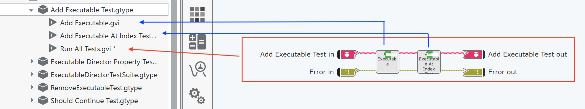
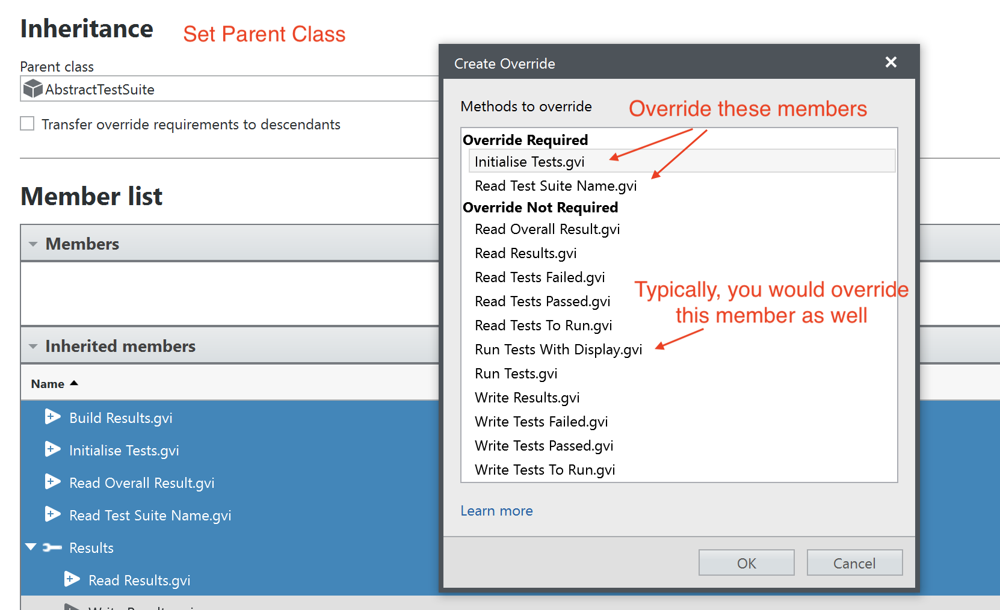

# Unit Test Framework
This framework provides a simple approach to unit testing VIs.  There are no CI hooks, or similar, as there are commercial implementations available that will do a much better job.  This is a lightweight framework but does undertake the 'heavy lifting' of unit testing.

## Dependencies
There are no dependencies for this framework.

  LabVIEW NXG 5.0 (current version) does not support the use of built libraries so there is no binary to deploy, you must use the source.

  See also [Installation](#installation) for further information to take into account.

## Installation
Download directory `Unit Testing Framework` to wherever you want it and you are good to go.

LabVIEW NXG 5.0 (current version) doesn't allow the use of built libraries so you will need to use it in your own project as source files.  You have two choices:
1. Copy the directory contents over to your own project and import the file(s).  They then become part of your project; or
2. Leave them where they are and import the directory to your project.  This will create a link to the framework instead and it will not be part of your project (see the image below.)

**Recommendation:**
It's recommended to link to the framework (option 2) as it will allow you to easily update it with newer versions.  Indeed, this is how the Hardware Abstraction Framework does it (as shown in the image above.)

I have found it beneficial to have the `libraries` directory to keep frameworks (essentially, unbuilt library projects) together.
## Overview
There are four namespaces in the framework:

* **Common:** all core classes and functionality.
* **Assertions:** all assertions that can be used to confirm test results.
* **Utilities:** some helper VIs with commonly re-used functionality within the framework but also for your use in creating tests.  Mainly related to extracting specific data types out of `Variants`.
* **Examples:** a set of implemented examples showing the use of the framework and wide variety of assertions.1

1. A future release will move this namespace out of the main framework so that it doesn't need to be deployed if not needed.

There are three classes that form the test features:

**Abstract Test:** the actual testing code that will be run

**Abstract Test Suite:** an aggregation of related Tests into one 'suite' of tests to be run together.

**Abstract Test Coordinator:** an aggregation of Test Suites to run together.

In Labview NXG, the concept of an `abstract class` doesn't exist, but the expectation is that these classes will be overriden by your own implementations.

The Test Coordinator and Test Suite will display the results of tests in their out-of-the-box implementations and overriding them will give you an easy way of running tests with a basic display of results:

<figure><figcaption>Test Coordinator Results</figcaption></figure>

 

<figure><figcaption>Test Suite Results (for Executables)</figcaption></figure>

It's not necessary to have a Test Coordinator if you don't wish to pull Test Suites together but it does provide a one-stop place to run all tests and validate their success.  Without one you will need to run Test Suites seperately and I have found that a good workflow with this framework is to run the Test Coordinator to find any failing Test Suites, then run those failing Test Suites to find the failing tests.

## Writing Tests
The [Overview](#overview) gives a brief introduction and a basic description of the three main classes involved in creating runnable tests.  In this section I'll provide more information about actually creating tests.

### Creating a Test
Create a class, e.g. `Add Executable Test`, and inherit from `AbstractTest`.  Then create an override for inherited member `Run All Tests`, and optionally, `Setup` and `Teardown`:

The framework executes these three members automatically and in the following order.

* **Setup:** In this member, create any necessary dummy data or setup code for your test to run.  By default the parent implementation does nothing so only override if required.
* **Run All Tests:** Write your test code in this member.  You can actually test more than one thing here, for example, you may want to run a number of tests that check a number of related VIs.  The granularity is up to you but my advice would to keep the tests highly coherent to each other.
* **Teardown:** Tidy-up any data or reset values etc. in this member.  By default the parent implementation does nothing so only override if required.

#### Anatomy of Run All Tests
As already mentioned, a Test could consist of just one actual test or it could consist of multiple, related tests - the choice is yours as is your degree of 'relatedness'.  In any case, the framework will call this member only once during any test run *but* each *actual* test will count as +1 toward the overall total of tests run.  Here's a couple of examples:

*Run All Tests using members - two tests altogether*

*Run All Tests member implementing two tests (complete implementation not shown)*

As you can see, implementing the code in Run All Tests could get quite large, and this example does not take advantage of using `setup` to create dummy data.  However, the framework doesn't care *how* you implement the test, nor indeed *how many* are implemented within one `Run All Tests` member.

So what does a test implementation actually look like.  Let's break down the first test in example 1 from above.  The test is for member `Add Executable` to ensure that it actually does add a given instance of an `Executable` to a collection (it's not important what an `Executable` is for the example, it's part of the `Hardware Abstraction Framework`.)  The test therefore must run this member and compare the *actual* result against an *expected* result.

Here's what it looks like:

There's a lot going on here but there are 4 steps to consider:
1. Here, the member `Add Executable` runs to add an Executable to a collection.  This is the code under test being executed.
2. Now we need to check the actual result against the expected result.  There are two `Set Value String` nodes shown: the top one is for the Actual result - you can see the data flow from `Read Executables` - the lower one for the Expected Result.  These nodes prepare the results for comparison with the assertion.  The Actual result consists of getting an array size of the Executables and turning this value into a variant and a String.  The node `Set Value String` is expecting two values: one value as a variant (so that ANY result data type can be passed for comparison by the Assertion) and the second is a 'readable' form of that result for use in results messages.  The same for Expected Result - in this case we expect the number of Executables to be 1 (one).
3. Here we create and populate a Formatted Test Result with the Class Under Test (actually, it can be whatever identifier makes sense to you) and a Test ID.  The framework will use these values plus the string values of the Actual and Expected result to create a useful result message for display.
4. The Actual Result, Expected Result, Formatted Test Result and a chosen Assertion - in this case we need to Assert that the size of the Executables array is equal to 1 - are passed into a `Process Result` node.  The framework uses the assertion to determine if the test passes or fails and updates its internal count of passes/fails accordingly.  A suitable result message is also built.

That's it - the basic anatomy of a Test: run the code under test to obtain an actual result; create an expected result and actual result; use an asserter to determine the pass/fail of the Test.

Within the framework, a Test doesn't actually show its result - this is the responsibility of the Test Suite, which actually runs the test.  Let's look at that.

### Creating a Test Suite
A Test Suite is used to collect together one or more related tests to run as a group.  How you determine 'relatedness' is up to you as there are no particular restrictions.  For simple projects, you could just use one Test Suite and no Test Coordinator for example, and have all Tests run together.

To create a Test Suite, create a class and have it inherit from AbstractTestSuite.  Then create an override for inherited members `Initialise Tests` and `Read Test Suite Name`, and, typically, `Run Tests With Display`:

The framework executes the first two of these members automatically at the right time; the third is manually run.

* **Initialise Tests:** In this member, you will tell the Test Suite which Tests it will run.
* **Read Test Suite Name:** Here, return a String which is how you will recognise the Test Suite when used with a Test Coordinator: this name appears in the latter's results display.
* **Run Tests With Display:** Typically, override this member as it will allow you to run the Test Suite and view Test results.  It will inherit the display elements from the parent implementation.  This member is NOT called by the framework, it is the launch VI for running the Test Suite's Tests.  If you only intend to use a Test Coordinator then don't implmement this method; if you wish to implement your own results display, create your own member VI to do so.  

#### Anatomy of Initialise Tests
This member is called in order to tell the Test Suite what Tests it will actually run.  Its responsiblity it to build a collection of these Tests - implement your version by emulating/copying from the parent:

(There's nothing at the bottom of that Case structure!)

All we do here is drop each Test that we want the Test Suite to run into the Case option, adding it into the `Build Array` node, the output of which is sent to node `Write Tests to Run` (a framework method.)

If you don't override this method then the Framework will raise an error.  Do not call the parent implementation!

LabVIEW NXG doesn't have much in the way of Reflection in its Object Oriented implementation so unfortunately the framework can't do something like `Find All Subclasses of Abstract Test With Name Beginning This Test Suite`2

2. A future version may create an easier way of doing this by asking the concrete implementation to return an array of Tests and building the Tests To Run itself.

#### Anatomy of Read Test Suite Name
Just return a name for this Test Suite:

#### Anatomy of Run Tests With Display
As noted above, this isn't a Framework member per-se.  The parent implementation is functional and if you override it then you will get the display elements to use automatically - by default it calls the parent implementation.  The framework itself never calls this member - it is manually run by you when you want to run the Test Suite; a Test Coordinator does not use this member to run a Test Suite.

You can of course create your own member to run the Test Suite and it doesn't have to be called `Run Tests With Display`.

Whilst you don't need to make changes you could.  Here, a Sequence has been added to clear any existing results before calling the parent implementation.

A Test Suite can run standalone but can also be aggregated into a collection of Test Suites by using a Test Coordinator.  Let's look at that.

### Creating a Test Coordinator
A Test Coordinator is used to collect together one or more Test Suites to run as a group.  Essentially, it is the easiest way to run all the Unit Tests you have created in one go.

To create a Test Coordinator, create a class and have it inherit from AbstractTestCoordinator.  Then create an override for inherited member `Initialise Test Suites`, and, typically, `Run Test Suites`:

The framework executes the first of these members automatically at the right time; the second is manually run.

* **Initialise Test Suites:** In this member, you will tell the Test Coordinator which Test Suites it will run.
* **Run Test Suites:** Typically, override this member as it will allow you to run the Test Coordinator and view Test results for each Test Suite.  It will inherit the display elements from the parent implementation.  This member is NOT called by the framework, it is the launch VI for running the Test Coordinator's Test Suites.  If you wish to implement your own results display, create your own member VI to do so.  

As you can see, a Test Coordinator is very similar to a Test Suite in its implementation.

#### Anatomy of Initialise Test Suites
This member is called in order to tell the Test Coordinator what Test Suites it will actually run.  Its responsiblity it to build a collection of these Test Suites - implement your version by emulating/copying from the parent:

(There's nothing at the bottom of that Case structure!)

All we do here is drop each Test Suite that we want the Test Coordinator to run into the Case option, adding it into the `Build Array` node, the output of which is sent to node `Write Test Suites` (a framework method.)

If you don't override this method then the Framework will raise an error.  Do not call the parent implementation!

#### Anatomy of Run Test Suites
As noted above, this is very similar to the way a Test Suite works in that this isn't a Framework member per-se.  The parent implementation is functional and if you override it then you will get the display elements to use automatically - by default it calls the parent implementation.  The framework itself never calls this member - it is manually run by you when you want to run the Test Coordinator.

You can of course create your own member to run the Test Coordinator and it doesn't have to be called `Run Test Suites`.

Here, no changes have been made and the override is fully functional from the start.  Of course, you can make your own changes to this member (an example of which is shown for the Test Suite).

### Summary
That's it, no more complicated than described thus far. Use the examples to get a better idea of how to implement these three classes for yourself.  This framework is also used extensively by the Hardware Abstraction Framework so there are plenty of examples available in that project as well.

## A Note on Assertions
The framework has a range of Assertions available to use:

If you wish to create your own then you just need to inherit from `AbstractAssertion` and override member `Assert`.  Here's an example from `Assert Equal`:

Your implementation can take the Expected Result and Actual Result variants and make the correct assertion.  Check out the helper VIs in namespace `Utilities` that convert variants to specific data types.  `Assertion Message` is a framework node that will prepare a result message and increment the pass/fail count for the Test.  The base message passed in is for a *failure* and should include placeholders `%s` for both the Expected Result and Actual Result (remember, you load the string values of the variants when writing the Test method.)  The success message is generated by the framework.

## Finally...
Any questions or problems, please raise them as an Issue and I will endeavour to answer with an update to this readme.  Happy testing...